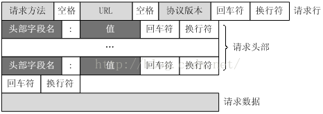

## 基本流程

* 等待用户连接我们的站点并发送一个 HTTP 请求；
* 解析请求；
* 计算出它所请求的；
* 获取数据（或动态生成）；
* 格式化数据为 HTML；
* 返回数据

```
class RequestHandler(BaseHTTPRequestHandler):

    # ...页面模板...
    Page＝"..待设计.."

    def do_GET(self):
        page = self.create_page()
        self.send_content(page)

    def create_page(self):
        # ...待实现...

    def send_content(self, page):
        # ...待实现...
```

## Request Handler

库里面的 BaseHTTPRequestHandler 类负责解析传进来的 HTTP 请求，并判断请求包含的方法。如果方法是 GET, 类将调用 do_GET 方法。我们的类 RequestHandler 重写了该方法以动态生成一个简单的页面: 文本页面存储在类级别变量中，我们将在发送给客户端 200 响应码，首部 Content-Type 字段以告诉客户端将返回的数据解析为 HTML，页面长度之后发送它。（end_headers 方法调用 插入空行以分隔首部和页面本身)。

```
    def end_headers(self):
        """Send the blank line ending the MIME headers."""
        if self.request_version != 'HTTP/0.9':
            self._headers_buffer.append(b"\r\n")
            self.flush_headers()

    def flush_headers(self):
        if hasattr(self, '_headers_buffer'):
            self.wfile.write(b"".join(self._headers_buffer))
            self._headers_buffer = []
```




## link 

* https://www.lanqiao.cn/courses/552/learning/?id=1867


